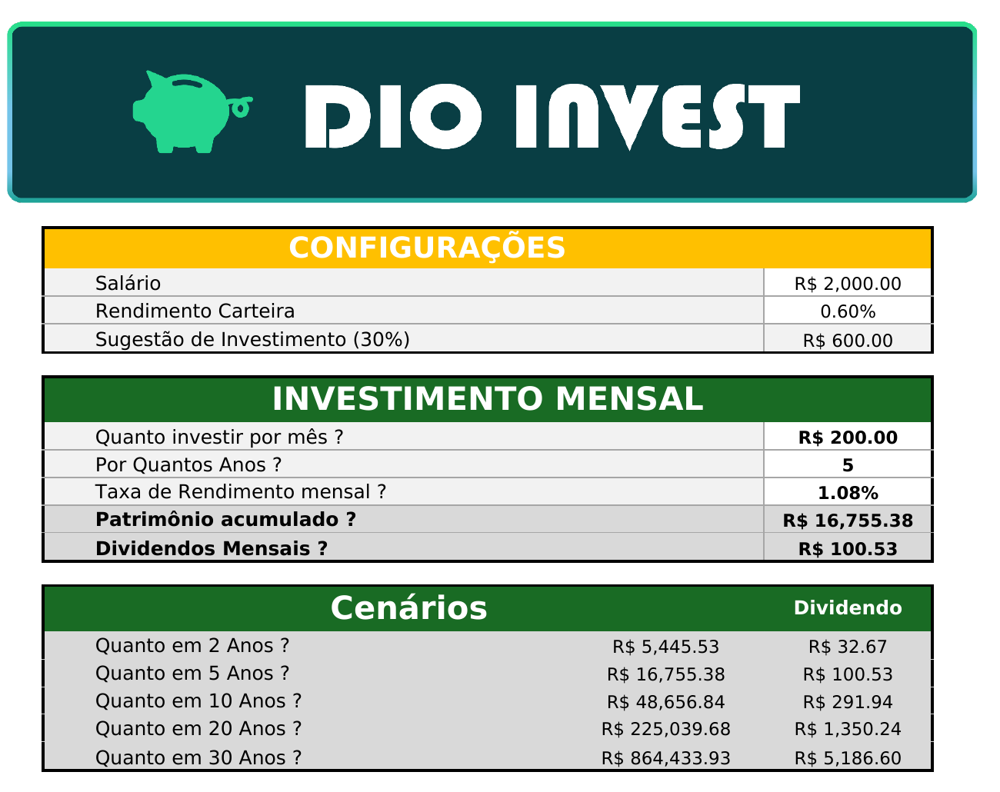
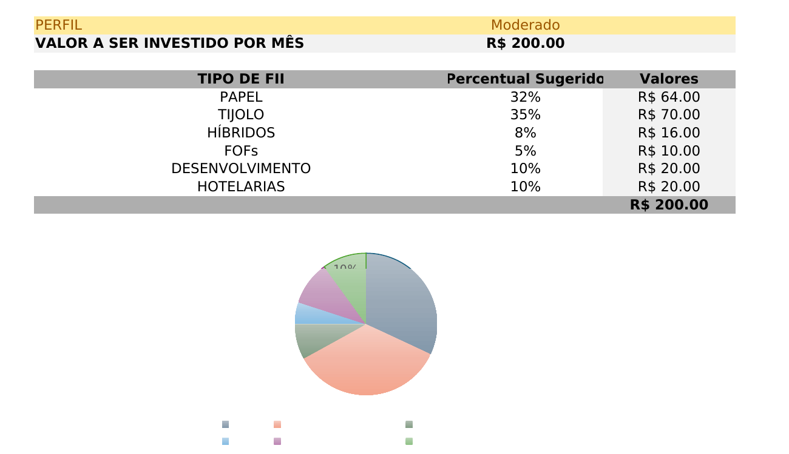

# 🏢 Simulador de Investimentos em Fundos Imobiliários (FIIs)

Projeto desenvolvido como desafio de código do **Bootcamp DIO** (Digital Innovation One), com o objetivo de aplicar conceitos de Excel na construção de uma ferramenta prática de simulação de investimentos em Fundos de Investimento Imobiliário (FIIs).



## 📖 Sobre o projeto

Investir em FIIs costuma levantar sempre as mesmas dúvidas: *quanto investir por mês? por quanto tempo? qual a taxa de rendimento esperada? quanto vou receber de dividendos?*

Este projeto responde a essas perguntas por meio de uma planilha Excel interativa que:

- Calcula o **patrimônio acumulado** ao final de um período de aportes mensais;
- Estima os **dividendos mensais** com base no rendimento médio da carteira;
- Projeta **cenários automáticos** (2, 5, 10, 20 e 30 anos) para o mesmo aporte mensal;
- Sugere uma **carteira de FIIs diversificada** (Papel, Tijolo, Híbridos, FOFs, Desenvolvimento e Hotelarias) de acordo com o perfil do investidor (Conservador, Moderado ou Agressivo).

## 🎯 Objetivos de aprendizagem

- Criar ferramentas de simulação de investimentos em Excel;
- Aplicar cálculos financeiros como rendimento mensal e cálculo de dividendos;
- Documentar processos técnicos de forma clara e estruturada;
- Utilizar o GitHub como ferramenta para compartilhamento de documentação técnica.

## ⚙️ Como a planilha funciona

O arquivo [`simulador-fii.xlsx`](simulador-fii.xlsx) é dividido em duas abas:

### Aba `APP` — Simulador principal

| Bloco | O que faz |
|---|---|
| **Configurações** | Define o salário informado, o rendimento médio esperado da carteira (`rendimento_carteira`) e sugere automaticamente 30% do salário como valor de investimento mensal. |
| **Investimento Mensal** | A partir do aporte mensal, do prazo em anos e da taxa de rendimento mensal, calcula o **patrimônio acumulado** com a função financeira `FV` (Valor Futuro) e os **dividendos mensais** multiplicando o patrimônio pelo rendimento da carteira. |
| **Cenários** | Repete o mesmo cálculo de `FV` para 5 prazos fixos (2, 5, 10, 20 e 30 anos), permitindo comparar rapidamente o crescimento do patrimônio e dos dividendos ao longo do tempo. |
| **Carteira recomendada** | A partir do perfil escolhido (Conservador, Moderado ou Agressivo), usa `VLOOKUP` para buscar na aba `Planilha2` o percentual sugerido para cada tipo de FII e calcula o valor em reais a alocar em cada um, exibindo o resultado também em um **gráfico de pizza**. |



### Aba `Planilha2` — Base de perfis

Tabela de apoio (não editável pelo usuário final) que relaciona cada **perfil de investidor** ao **percentual recomendado** por tipo de fundo imobiliário:

| Perfil | Papel | Tijolo | Híbridos | FOFs | Desenvolvimento | Hotelarias |
|---|---|---|---|---|---|---|
| Conservador | 30% | 50% | 10% | 10% | 0% | 0% |
| Moderado | 32% | 35% | 8% | 5% | 10% | 10% |
| Agressivo | 50% | 10% | 5% | 5% | 20% | 10% |

Essa tabela é consultada pela aba `APP` através de uma **chave concatenada** (`Perfil-TipoDeFII`), buscada com `VLOOKUP`.

### Principais fórmulas utilizadas

```
Patrimônio acumulado   = FV(taxa_mensal; qtd_anos*12; aporte*-1)
Dividendos mensais     = patrimônio * rendimento_carteira
Valor por tipo de FII  = VLOOKUP(perfil & "-" & tipo_fii; Planilha2!A:D; 4; FALSO) * aporte
```

> A planilha usa **intervalos nomeados** (`taxa_mensal`, `qtd_anos`, `aporte`, `patrimonio`, `rendimento_carteira`) para deixar as fórmulas mais legíveis, no lugar de referências soltas como `D19` ou `D17`.

## ▶️ Como usar

1. Baixe o arquivo [`simulador-fii.xlsx`](simulador-fii.xlsx) e abra no Excel (ou Google Sheets/LibreOffice Calc);
2. Na aba `APP`, preencha as células de entrada em **"Investimento Mensal"**:
   - Quanto investir por mês;
   - Por quantos anos pretende investir;
   - Taxa de rendimento mensal esperada;
3. Escolha o **perfil de investidor** (Conservador, Moderado ou Agressivo) no bloco de carteira recomendada;
4. Veja o **patrimônio acumulado**, os **dividendos mensais** estimados, os **cenários de longo prazo** e a **divisão sugerida da carteira** atualizados automaticamente.

## 🧠 Principais aprendizados

- Uso da função financeira `FV` para projetar valor futuro de aportes mensais constantes;
- Combinação de `VLOOKUP` com concatenação de texto para montar chaves de busca dinâmicas;
- Organização de uma planilha em blocos de **entrada (inputs)**, **cálculo** e **saída (outputs)**, facilitando a leitura e manutenção;
- Uso de **intervalos nomeados** para tornar fórmulas financeiras mais legíveis;
- Representação visual de dados com gráfico de pizza para leitura rápida da alocação de carteira;
- Importância de documentar tecnicamente um projeto e publicá-lo no GitHub como parte do portfólio.

## 🛠️ Tecnologias utilizadas

- Microsoft Excel (fórmulas financeiras, `VLOOKUP`, gráficos e intervalos nomeados)
- Git & GitHub (versionamento e documentação do projeto)

## 📁 Estrutura do repositório

```
.
├── README.md                          # Esta documentação
├── simulador-fii.xlsx                 # Planilha do simulador de investimentos em FIIs
└── images/
    ├── 01-simulador-investimento.png  # Print do bloco de configurações e cenários
    └── 02-carteira-recomendada.png    # Print da carteira recomendada e gráfico
```

## 🙋 Autor

**Michelton Pádua**
Projeto desenvolvido durante o Bootcamp **DIO** — trilha de Excel aplicado a finanças pessoais.

## 🎓 Créditos

Desafio de projeto proposto pela [DIO (Digital Innovation One)](https://www.dio.me/) como parte da trilha de aulas sobre simulação de investimentos em Excel.
